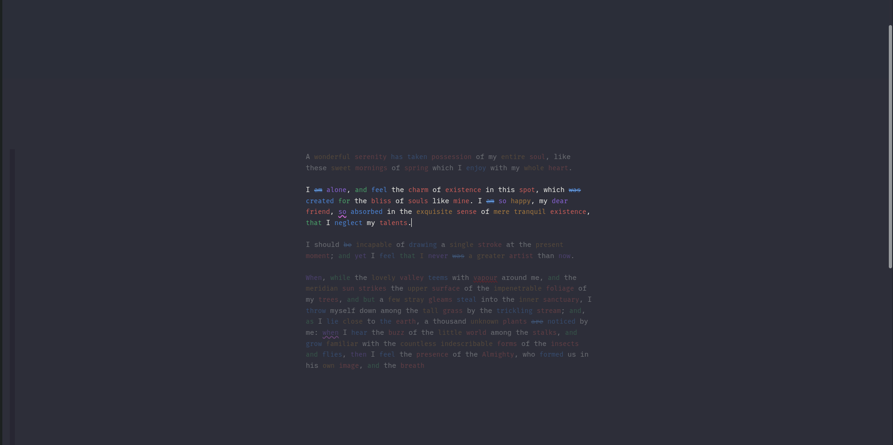
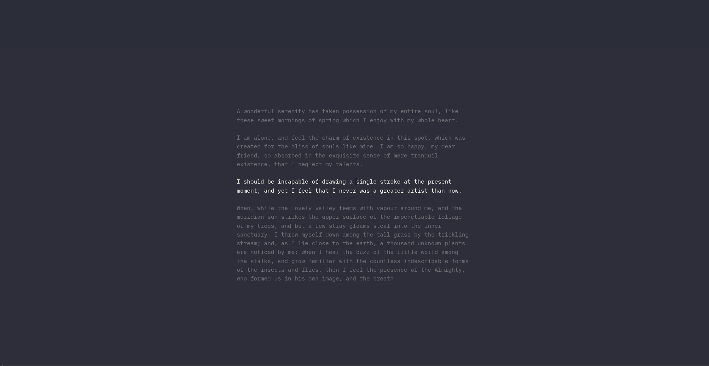

# Joplin Zen Mode

A focused writing mode for Joplin’s Markdown editor, inspired by iA Writer.

## What it does

Zen Mode trims the editing experience down to the text that matters most:

- hides surrounding editor chrome and distraction panels while Zen is active
- keeps the current paragraph or sentence bright while dimming surrounding text
- keeps the cursor vertically centered while writing
- adds optional syntax highlighting for parts of speech
- adds optional style checks for fillers, clichés, redundancies, weak phrases, and repetitions
- works with Joplin’s CodeMirror 6 Markdown editor on desktop and mobile

## Current feature summary

### Focus / Zen writing mode
- Toggle Zen mode from toolbar, menu, command palette, or shortcut
- Paragraph or sentence focus mode
- Adjustable inactive-text opacity
- Adjustable content width and vertical offset
- Optional font family, font size, text color, and background color overrides

### Syntax highlight
Inspired by iA Writer’s Syntax Highlight.

Default legend:
- **Brown** = adjectives
- **Red** = nouns
- **Purple** = adverbs
- **Blue** = verbs
- **Green** = conjunctions

Configurable options:
- enable/disable syntax highlight globally
- enable/disable each POS category individually
- choose syntax display style:
  - color
  - underline
  - subtle background
- customize each category color via settings

### Style check
Inspired by iA Writer’s Style Check.

Checks currently include:
- fillers
- clichés
- redundancies
- weak phrases
- repeated adjectives / verbs / adverbs inside a paragraph
- custom patterns and exceptions

Configurable options:
- enable/disable style check globally
- enable/disable each rule group individually
- choose mark style:
  - strikethrough
  - dotted underline
  - wavy underline
- customize rule colors via settings
- add extra fillers / clichés / redundancies / weak phrases in settings
- add custom patterns and exceptions in settings

## Placeholder screenshots

These are placeholder mockups for documentation only.

### Zen focus mode

### Syntax highlight

### Style check

## Commands and shortcuts

### Zen mode
- **Toggle Zen mode**
  - command palette: `Toggle Zen mode`
  - menu: `View`
  - shortcut: `Ctrl+Shift+Z`

### Syntax/style matching inside Zen
Useful for quickly switching between “writing” and “editing”.

- **Toggle Zen syntax/style matching**
  - command palette: `Toggle Zen syntax/style matching`
  - menu: `View`
  - editor context menu
  - shortcut: `Ctrl+Alt+M`

## Custom phrase lists
The plugin includes built-in phrase lists and also lets you extend them.

Settings fields available for user-defined additions:
- Extra fillers to flag
- Extra clichés to flag
- Extra redundancies to flag
- Extra weak phrases to flag
- Style check: custom patterns / exceptions

Each “extra” field accepts one phrase per line.

## Internal docs in this project

These files are included to help tune and regression-test the plugin:

- `docs/internal-regression-note-list.md`
- `docs/redundancy-list.md`
- `docs/cliche-list.md`

They are useful when adjusting dictionaries, repetition logic, and phrase matching.

## What the `/joplin-src` folder is for

In this workspace, `/joplin-src` is a local checkout of Joplin’s source code that was used as a development/reference aid.

It can/should be used for:
- checking current Joplin plugin API typings and behavior
- inspecting internal commands, layout classes, and CodeMirror integration
- comparing desktop and mobile editor behavior
- validating assumptions against the current Joplin source instead of guessing

It should **not** be used for:
- bundling Joplin source into the plugin
- importing internal Joplin app modules directly into the plugin runtime
- shipping any dependency on private/internal Joplin source paths

In short: it is a **reference and debugging resource**, not part of the final plugin package.

## Notes

- The plugin targets the current CodeMirror 6 Markdown editor.
- On desktop it hides layout panes and editor chrome while Zen mode is active.
- On mobile it applies the focus/editor features within the mobile plugin/editor constraints.
- The packaged plugin file is in `publish/io.arena.joplinzenmode.jpl`.

## Brief changelog

### Current build

> [!IMPORTANT]
> Version (14) switchted to `wink-nlp` for desktop (from compromise)

- improved verb detection for many `-ing`, `-s`, `-es`, and `-ies` forms
- added repetition detection for adjectives, verbs, and adverbs
- added quick toggle for all Zen syntax/style matching
- added visible settings for custom syntax and style-check colors
- added user-extensible phrase lists for fillers, clichés, redundancies, and weak phrases
- added internal regression, redundancy, and cliché documentation lists
- added placeholder screenshots to the README

### Earlier recent work
- added sentence-vs-paragraph focus mode
- added syntax highlight and style check scaffolding inspired by iA Writer
- added per-category syntax toggles
- added configurable syntax/style mark modes
- improved desktop/mobile split for analysis cost
- added `Ctrl+Shift+Z` for Zen mode toggle
- fixed several UI issues around hidden panels and restore behavior
